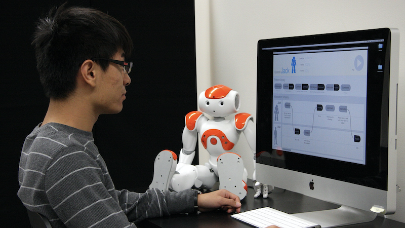
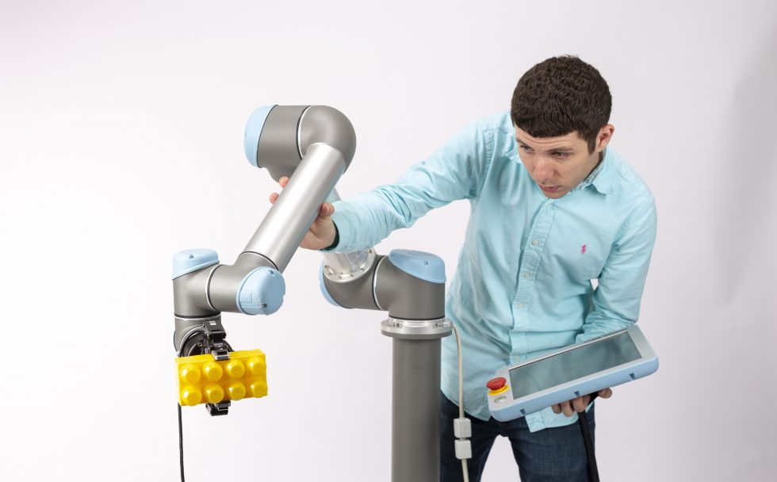
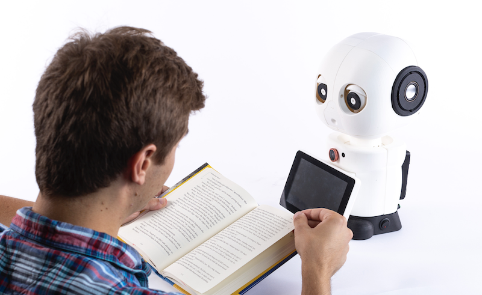
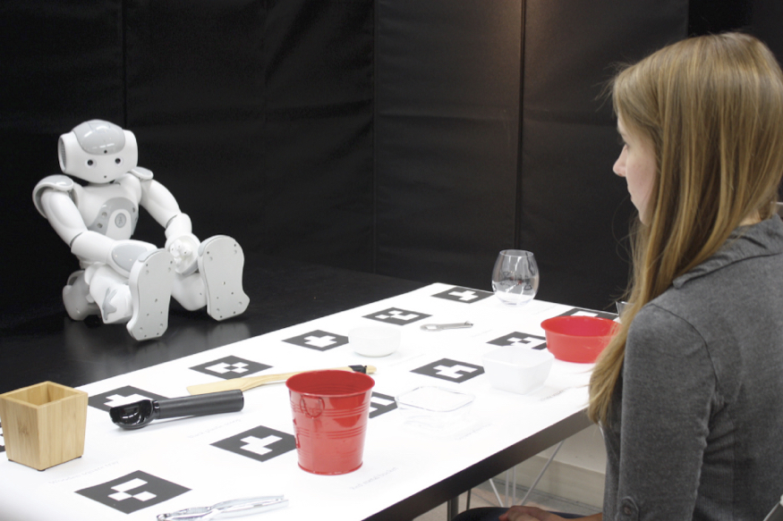

I am Sheldon B. and Marianne S. Lubar Professor of [Computer Science](http://cs.wisc.edu/), [Psychology](http://psych.wisc.edu/), and [Industrial Engineering](http://www.engr.wisc.edu/isye.html) at the [University of Wisconsin–Madison](http://wisc.edu/) and the director of the [People and Robots Laboratory](http://peopleandrobots.wisc.edu/). I received my PhD degree from [Carnegie Mellon University](http://cmu.edu/)‘s [Human-Computer Interaction Institute](http://hcii.cs.cmu.edu/) in 2009.

I am the chief editor of the [HRI section of the journal Frontiers in Robotics & AI](https://www.frontiersin.org/journals/robotics-and-ai/sections/human-robot-interaction#). If you are an HRI researcher interested in publishing in a rigorous, open-access venue, please submit! I am also an associated editor of [Human-Computer Interaction](https://www.tandfonline.com/toc/hhci20/current) and [Foundations and Trends® in Human-Computer Interaction](https://www.nowpublishers.com/HCI). I am also the secretary-treasurer of the [HCI Consortium](http://hcic.org/).

If you are interested in joining the People and Robots Lab, please read [this page](/joining).

<strong><a href="https://drive.google.com/file/d/1Pq9XBPEpere0rzyoGxmXvgbgmnK-B6r-/view?usp=sharing" target="_blank">Download my CV</a></strong> — _Updated: October 2021_

## Research

My research in [human-robot interaction (HRI)](https://en.wikipedia.org/wiki/Human–robot_interaction) builds human-centered principles and methods to enable effective and intuitive interactions between people and robotic technologies and facilitate the successful integration of these technologies into human environments. Below are highlights from ongoing projects in the [People and Robots Lab](http://peopleandrobots.wisc.edu/).

|  |  |
| :-: | :-: |
| **[HRI Design Tools]((/portfolio/portfolio-1))** | **[Human-Robot Collaboration](/portfolio/portfolio-2)** | 
|  |  |
| **[Building Social Companions](/portfolio/portfolio-3)** | **[Supporting Social Participation](/portfolio/portfolio-4)** |

## Teaching

I teach undergraduate and graduate classes on human-computer interaction, user experience design, and research methods. Below are courses that I am currently teaching or have taught in the last year.

|  |  |
| :-: | :-: |
| **[Building User Interfaces](/teaching/teaching-1)** | **[HCI Research Methods](/teaching/teaching-2)** |

## Advising

I work with a fantastic group of advisees who come from a diverse set of background including computer science, industrial design, industrial engineering, and history who are already building their own research programs. If you are interested in working with me, please read [this page](/joining/).

| Current Advisees  | Past Advisees |
| :------------- | :------------- |
| [Emmanuel Senft](https://emmanuel-senft.github.io/), *Postdoctoral Researcher* | [Sean Andrist](https://seanandrist.com), *PhD Advisee,* Microsoft Research |
| [Hajin Lim](https://www.hajinlim.com), *Postdoctoral Researcher* | [Joseph Michaelis](https://lsri.uic.edu/profiles/michaelis-joseph/), *PhD Advisee,* University of Illinois Chicago |
| [Bengisu Cagiltay](https://www.linkedin.com/in/bengisucagiltay/), *CS Graduate Student* | [Tomislav Pejsa](http://pages.cs.wisc.edu/~tpejsa/), *PhD Advisee,* Facebook |
| Amy Eiko, *CS Graduate Student* | [Chien-Ming Huang](https://www.cs.jhu.edu/~cmhuang/), *PhD Advisee,* Johns Hopkins University |
| Christine Lee, *CS Graduate Student* | [Daniel Szafir](https://cs.unc.edu/person/daniel-szafir/), *PhD Advisee,* University of North Carolina Chapel Hill |
| Nitzan Orr, *CS Graduate Student* | [Irene Rae](http://rene.chargingwombat.com/), *PhD Advisee,* Google, Inc. |
| [David Porfirio](http://pages.cs.wisc.edu/~dporfirio/), *CS Graduate Student* | [Allison Sauppé](https://cs.uwlax.edu/~asauppe/), *PhD Advisee,* University of Wisconsin–La Crosse |
| [Pragathi Praveena](https://www.linkedin.com/in/pragathip/), *CS Graduate Student* | [Shadeequa Miller](https://www.linkedin.com/in/s-dee-miller-58240710), *PhD Advisee,* Dell Corporation |
| [Danny Rakita](https://uwnarratives.wisc.edu/bio/daniel-rakita/), *CS Graduate Student* | [Curt Henrichs](https://robotics.wisc.edu/staff/henrichs-curt/), *MS Advisee,* Integrated Dynamic Electron Solutions, Inc. |
| [Andrew Schoen](https://andrewjschoen.github.io/), *CS Graduate Student* | [Steven Johnson](http://pages.cs.wisc.edu/~sjj/), *MS Advisee,* Google, Inc. |
| [Laura Stegner](http://laurastegner.com/), *CS Graduate Student* | [Margaret Pearce](https://www.linkedin.com/in/margaretpearce), *MS Advisee,* Deepfield |
| Dakota Sullivan, *CS Graduate Student* | [Christopher Bodden](https://uwnarratives.wisc.edu/bio/christopher-bodden/), *MS Advisee,* Software Engineer |
| [Olivia Zhao](https://www.olivia-zhao.com/), *Psychology Graduate Student* | [Faisal Khan](https://uwnarratives.wisc.edu/bio/christopher-bodden/), *MS Advisee,* Argonne National Lab |
| Kevin Welsh, *CS Graduate Student* | [Erica Lewis](http://ericaslewis.com/), *BS Advisee,* Intel |
| Nathan White, *CS Graduate Student* | [Nathalie Cheng](http://www.linkedin.com/in/nathaliecheng), *BS Advisee,* Exygy |
| | [Jonathan Mumm](http://www.linkedin.com/in/jonathanrmumm), *BS Advisee,* Atomic Labs |
| | [Zhi Tan](http://xiangzhitan.com/), *BS Advisee,* CMU Robotics Institute |
